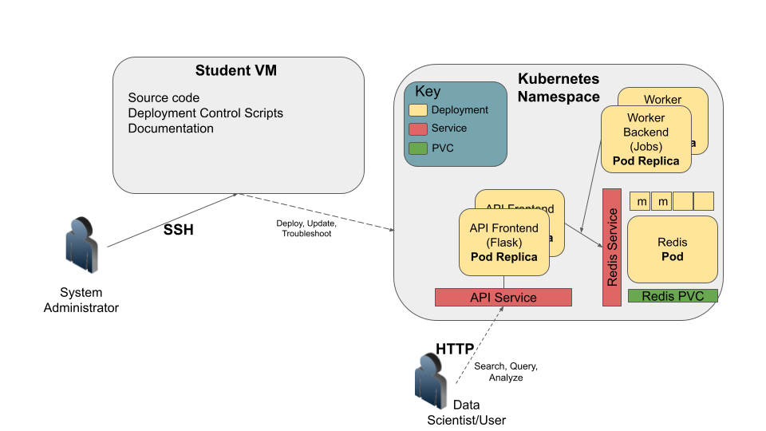

Introduction to Software Design
===============================

In this section, we introduce the topic of Software Design. There are many aspects and concepts related to Software Design --
many more than can be covered in a single semester -- and indeed, the topics we present throughout the 
rest of the semester will be, at least in part, aimed at tackling one or more aspects of design. Here, we simply provide 
a high-level overview of the Software Design landscape.

Software Design as a Process
-----------------------------
On the one hand, designing software is a process involving different types of people -- architects, developers, project managers, 
funding groups, etc. -- and there are different paradigms, methodologies and frameworks for guiding this process. 

Here are just a few examples: 

* Waterfall Method -- Software tasks are organized into sets or "phases" with a linear ordering; tasks from each phase are
  completed before moving to the next phase. In practice, phases tended to be longer (on the order of weeks or months) for
  larger projects than could span years. 
* Agile Method-- In contrast to Waterfall, Agile advocates smaller, complete software development life cycles, where "minimal"
  products are released and then incrementally improved. 
* Test Driven Development -- Developers write tests asserting what the software should do before writing any software. 
  Initially, all the tests fail, but as the software gets closer to completion and more functionality is developed, 
  the tests increasingly pass. 

We will not focus a whole lot on Software Design as a process, and, in particular, we will not discuss any of the specific 
methodologies or frameworks in depth. We will, however, introduce some common phases, such as requirements gathering, 
architectural design, acceptance testing, etc. 

Software Design Principles
--------------------------
Another way to think of Software Design is as a set of principles and associated techniques for achieving software with
certain qualities. In this class, we will be mostly focusing on Software Design principles. 

Throughout the course of the semester we will discuss techniques that help achieve the following Software Design principles:

Modularity
~~~~~~~~~~
Modularity involves dividing the components of software into parts. There are two principles that guide how we 
decompose software:

Intra-Module Cohesion
^^^^^^^^^^^^^^^^^^^^^
Cohesion refers to the similarity of the elements contained within a component (or "module"). When designing software,
we strive to *increase* cohesion within a module. That is, we want to group similar functionality together. This can be 
at a low-level or at a high-level.

For example, thinking at a "low level", we want to group together Python functions, variables, etc. into modules and 
packages based on functionality. We've already seen examples of this from the Python standard library: the ``json`` module
collects Python code related to working with JSON data.

At a higher level, as the class progresses we will be developing multiple individual programs that integrate together to 
form a complete system. These individual programs focus on specific tasks, providing good cohesion.

Inter-Module Coupling
^^^^^^^^^^^^^^^^^^^^^
Coupling refers to the degree to which two components depend on each other. There are several ways to formalize the notion of 
coupling and make it something one can measure. For example, given components A and B, we can ask:

 * If component A changes, to what extent must component B change for component B to continue to function?
 * If component A fails, to what extent can component B continue to function? 
 * For each piece of functionality in component A, when executing that function, how many pieces of functionality in component B 
   execute? 

According to the design principle, we want to *reduce* inter-module coupling (sometimes called "loose coupling"). Reduced coupling
allows different parts of the software to be modified independently and created more robust software. 

Abstraction
~~~~~~~~~~~
You likely already know the concept of abstraction from math and science courses. The real world is very complicated.
With abstraction, we replace an exact concept with a simplified model. The Bohr Atom is an example of an abstraction of matter. 

You have seen examples of abstractions in software also. For instance, we saw how the Python function ``open()`` returns
a "file object" (cf., https://docs.python.org/3/glossary.html#term-file-object). A file object is an abstraction representing
data stored in different formats. With a file object, you can do certain actions, represented by functions, e.g.,:

* Read data from the file object.
* Write data to the file object.

Note that when dealing with an actual file stored on a hard drive, the individual bytes are organized into blocks and sectors. 
These details and others are hidden from us when we use Python's file object abstraction, which makes it much easier to use. 
It also allows the file object to be used for other kinds of data storage, as we'll see in the next section. 

Generalization
~~~~~~~~~~~~~~
Generalization allows the same software component to be used in different situations. It improves the reusability of software.

Generalization and Abstraction go hand and hand: using well-designed abstractions allows the same model to be used in many 
places. Continuing with the example above, it turns out that we can use the same file objects to handle data from a lot 
of different sources, including:

* Actual files stored on the hard drive
* Standard input and output 
* In-memory buffers 
* Sockets 
* Unix pipes 

And more! That illustrates the power of abstraction: by learning just a few concepts and functions (e.g., ``open``, 
``read``, ``write``, etc.) one is able to deal with all of this different kinds of data sources!

Portability and Reproducibility
~~~~~~~~~~~~~~~~~~~~~~~~~~~~~~~
The last design principle we will mention is that of software portability and the related concept of reproducibility. 
Portability refers to the ability to access and execute software from different kinds of computers, while reproducibility
means that the results obtained from executing the software at one time can be obtained later. We will spend a significant
amount of time this semester working with techniques that improve the portability of the software we develop.

Software Design Goals for COE 332
---------------------------------
During the course of the semester, you will build a large (by some measure), distributed sofware 
system for data analysis. You're system will comprise many components and thousands of lines of code. An
example illustration of a typical final class project is shown below, to give an indication of where we 
are headed.

As we add components and complexity, these software design principles will become increasingly important.

Our goals for COE 332 are to illustrate these design concepts so that you can recognize them and apply them,
not just towards the design of distributed systems and/or data analysis, but all kinds of different software.
While in this course we'll illustrate these principles in the context of distributed systems, they are
broadly applicable to all large software projects. 
