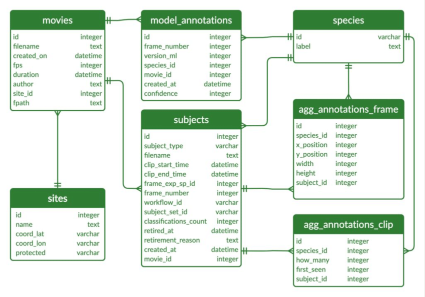
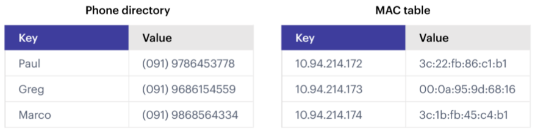

Intro to Databases and Persistence
==================================

Application data that lives inside a container is ephemeral - it only persists
for the lifetime of the container. We can use databases to extend the life of
our application (or user) data, and even access it from outside the container.

After going through this module, students should be able to:

* Explain the differences between SQL and NoSQL databases
* Choose the appropriate type of database for a given application / data set
* Start and find the correct port for a Redis server
* Install and import the Redis Python library
* Add data to and retrieve data from a Redis database from a Python script
* **Design Principles:** Separating the database service from the 
  application container is a great example illustrating the *modularity* design
  principle.

What's Our Motivation?
----------------------

In this unit, we will begin the work to extend our Flask API to enable users to query and analyze data
in our data sets. We want to expose this functionality through our Flask API, but there is an issue:
the analysis to be performed may take "a long time" to compute, longer than the acceptable time window
for an HTTP request/response cycle. We need a way to coordinate the work of computing the analysis
in a separate Python program from our Flask API. The database will play a central role.

Our basic approach will be:

1. Our dataset will be stored in a database.
2. The user submits a request to a Flask endpoint describing some sort of
   analysis they wish to perform on the data.
3. We will create a separate Python program to perform the analysis. This program will retrieve the
   desired data from the database and store the final results in the database.
4. The Flask API will determine the status of the analysis by querying the database, and it will
   retrieve the final results of the analysis from the database to serve to the user when they are ready.

There are a lot of details to fill in over the course of the rest of the semester, but for now
we are going to focus on getting data into and out of a database.

Intro to Databases
------------------

**What is a database?**

* A database is an organized collection of structured information, or data,
  typically stored electronically in a computer system.
* Databases provide a **query language** - a small, domain-specific language for interacting with the
  data. The query language is not like a typical programming language such as Python or C++; you
  cannot create large, complex programs with it. Instead, it is intended to allow for easy, efficient
  access to the data.

**Why use a database?**

* Our data needs permanence and we want to be able to stop and start our Flask
  API without losing data.
* We want multiple Python processes to be able to access the data at the same
  time, including Python processes that may be running on different computers.

**Why not use a file?**

* It is not easy to make a file accessible to Python processes on different
  computers / VMs.
* When multiple processes are reading from and writing to a file, race conditions
  can occur.
* With files, our Flask API would have to implement all the structure in the data.

Databases sometimes get classified into two broad categories: SQL databases (also called
relational databases) and NoSQL databases.

SQL Databases
-------------
Structured Query Language (SQL) is a language for managing structured or relational data, where
certain objects in the dataset are related to other objects in a formally or mathematically precise
way. SQL is the language used when working with a relational database. You will often see SQL
database technologies referred to as Relational Database Management Systems (RDBMS).

The SQL language is governed by an ISO standard, and relational databases are among the most popular
databases in use today. SQL was originally based on a strong, theoretical framework called the
Relational Model (and related concepts). However, today's SQL has departed significantly from that
formal framework.

Popular open-source RBDMS include:

* MySQL
* Postgres
* Sqlite

    
    Example of a relational database. `Source1 <https://dx.doi.org/10.3897/BDJ.9.e60548>`_

NoSQL Databases
----------------

As the name implies, a NoSQL database is simply a database that does not use SQL.
There are many different types of NoSQL databases, including:

* Time series databases
* Document stores
* Graph databases
* Simple key-value stores (like the one we will use in this class)

In some ways, it is easier to say what a NoSQL database isn't than what it is; some of the key attributes
include:

* NoSQL databases do **NOT** use tables (data structured using rows and columns)
  connected through relations
* NoSQL databases store data in "collections", "logical databases", or similar containers
* NoSQL databases often allow for missing or different attributes on objects in the same collection
* Objects in one collection do not relate or link to objects in another collection
* For example, the objects themselves could be JSON objects without a pre-defined schema

    
    Example of a key-value database. `Source2 <https://redis.com/nosql/key-value-databases/>`_

**SQL vs NoSQL**

Comparing SQL and NoSQL is an apples to oranges comparison.

* Both SQL and NoSQL databases have advantages and disadvantages.
* The *primary* deciding factor should be the *shape* of the data and the requirements on the
  integrity of the data. In practice, many other considerations could come into play, such as what
  expertise the project team has.
* Also consider how the data may change over time, and how important is the
  relationship between the different types of data being stored.
* SQL databases "enforce" relationships between data types, including one-to-one, one-to-many,
  and many-to-many. When the integrity of the data is important, SQL databases are a good choice.
* In many NoSQL databases, the relationship enforcement must be programmed into the application. This
  can be error-prone and can increase the development effort needed to build the application. On the
  other hand, this can allow the
  database to be used for use cases where relationship enforcement is not possible.
* SQL databases historically cannot scale to the "largest" quantities of data because of
  the ACID (Atomicity, Consistency, Isolation, Durability) guarantees they make (though this is an
  active area of research).
* NoSQL databases trade ACID guarantees for weaker properties (e.g., "eventual consistency") and
  greater scalability. It would be difficult to scale a relational database to contain
  the HTML of all websites on the internet or even all tweets ever published.

For the projects in this class, we are going to use Redis, a simple (NoSQL) "data structure" store.
There are a few reasons for this choice:

* We need a flexible data model, as the structure of the data we will store in the database will
  be changing significantly over the course of the semester.
* We need a tool that is quick to learn and simple to use. This is not a databases course, and
  learning the SQL language would take significantly more time than we can afford.
* Redis can also easily be used as a task queue, which we will make use of in the asynchronous
  programming unit.

Redis
-----

Redis is a very popular NoSQL database and "data structure store" with lots of
advanced features including:

.. note::

   Before going any further, let's play around with Redis a little bit in a browser:
   `https://try.redis.io/ <https://try.redis.io/>`_
   Try the commands ``SET``, ``GET``, ``HSET``, ``HGET``, ``KEYS``, ``HKEYS``

Key-Value Store
~~~~~~~~~~~~~~~

Redis provides key-value store functionality:

* The items stored in a Redis database are structured as ``key:value`` objects.
* The primary requirement is that the ``key`` be unique across the database.
* A single Redis server can support multiple databases, indexed by an integer.
* The data itself can be stored as JSON.

Notes about Keys
~~~~~~~~~~~~~~~~

Redis keys have the following properties/requirements:

* Keys are often strings, but they can be any "binary sequence".
* Long keys can lead to performance issues.
* A format such as ``<object_type>:<object_id>`` is a good practice.

Notes on Values
~~~~~~~~~~~~~~~

* Values are typed; some of the primary types include:

  * Binary-safe strings
  * Lists (sorted collections of strings)
  * Sets (unsorted, unique collections of strings)
  * Hashes (maps of fields with associated values; both field and value are type ``string``)

* There is no native "JSON" type; to store JSON, one can use an encoding and store
  the data as a binary-safe string, or one can use a hash and convert the object
  into and out of JSON.
* The basic string type is a "binary-safe" string, meaning it must include an
  encoding.

  * In Python terms, the string is stored and returned as type ``bytes``.
  * By default, the string will be encoded with UTF-8, but we can specify the
    encoding when storing the string.
  * Since bytes are returned, it will be our responsibility to decode using the
    same encoding.

Hash Maps
~~~~~~~~~

* Hashes provide another way of storing dictionary-like data in Redis
* The values of the keys are type ``string``

Running Redis
-------------

To use Redis on your Jetstream VMs, we must have an instance of the Redis server
running. We will use a `containerized version of Redis <https://hub.docker.com/_/redis/tags>`_
that we each need to pull from Docker Hub:

.. code-block:: console

   # start the Redis server on the command line:
   [user-vm]$ docker run -p 6379:6379 redis:7
   1:C 01 Mar 2023 22:01:28.798 # oO0OoO0OoO0Oo Redis is starting oO0OoO0OoO0Oo
   1:C 01 Mar 2023 22:01:28.798 # Redis version=7.0.9, bits=64, commit=00000000, modified=0, pid=1, just started
   1:C 01 Mar 2023 22:01:28.798 # Warning: no config file specified, using the default config. In order to specify a config file use redis-server /path/to/redis.conf
   1:M 01 Mar 2023 22:01:28.799 * monotonic clock: POSIX clock_gettime
   1:M 01 Mar 2023 22:01:28.799 * Running mode=standalone, port=6379.
   1:M 01 Mar 2023 22:01:28.799 # Server initialized
   1:M 01 Mar 2023 22:01:28.799 # WARNING Memory overcommit must be enabled! Without it, a background save or replication may fail under low memory condition. Being disabled, it can can also cause failures without low memory condition, see https://github.com/jemalloc/jemalloc/issues/1328. To fix this issue add 'vm.overcommit_memory = 1' to /etc/sysctl.conf and then reboot or run the command 'sysctl vm.overcommit_memory=1' for this to take effect.
   1:M 01 Mar 2023 22:01:28.800 * Ready to accept connections

The Redis server is up and available. Although we could use the Redis CLI to
interact with the server directly, in this class we will focus on the Redis
Python library so we can interact with the server from our Python scripts.

.. note::

   According to the log above, Redis is listening on the default port, **6379**.

First install the Redis Python library in your user account:

.. code-block:: console

   [user-vm]$ pip3 install --user redis

Then open up an interactive Python interpreter to connect to the server:

.. code-block:: console

   [user-vm]$ python3
   Python 3.8.10 (default, Nov 14 2022, 12:59:47) 
   [GCC 9.4.0] on linux
   Type "help", "copyright", "credits" or "license" for more information.
   >>>

.. code-block:: python3

   >>> import redis
   >>>
   >>> rd=redis.Redis(host='127.0.0.1', port=6379, db=<some integer>)
   >>>
   >>> type(rd)
   <class 'redis.client.Redis'>

You've just created a Python client object to the Redis server called ``rd``. This
object has methods for adding, modifying, deleting, and analyzing data in
the database instance, among other things.

Some quick notes:

* We are using the IP of the gateway (``127.0.0.1``) on our localhost and the
  default Redis port (``6379``).
* Redis organizes collections into "databases" identified by an integer index.
  Here, we are specifying ``db=<some integer>``; if that database does not exist it will be
  created for us.

Working with Redis
------------------

We can create new entries in the database using the ``.set()`` method. Remember,
entries in a Redis database take the form of a key:value pair. For example:

.. code-block:: python3

   >>> rd.set('my_key', 'my_value')
   True

This operation saved a key in the Redis server (``db=0``) called ``my_key`` and
with value ``my_value``. Note the method returned True, indicating that the
request was successful.

We can retrieve it using the ``.get()`` method:

.. code-block:: python3

   >>> rd.get('my_key')
   b'my_value'

Note that ``b'my_value'`` was returned; in particular, Redis returned binary
data (i.e., type ``bytes``). The string was encoded for us (in this case, using
Unicode). We could have been explicit and set the encoding ourselves. The
``bytes`` class has a ``.decode()`` method that can convert this back to a
normal string, e.g.:

.. code-block:: python3

   >>> rd.get('my_key')
   b'my_value'
   >>> type(rd.get('my_key'))
   <class 'bytes'>
   >>>
   >>> rd.get('my_key').decode('utf-8')
   'my_value'
   >>> type( rd.get('my_key').decode('utf-8') )
   <class 'str'>

Redis and JSON
--------------

A lot of the information we exchange comes in JSON or Python dictionary format.
To store pure JSON as a binary-safe string ``value`` in a Redis database, we
need to be sure to dump it as a string (``json.dumps()``):

.. code-block:: python3

   >>> import json
   >>> d = {'a': 1, 'b': 2, 'c': 3}
   >>> rd.set('k1', json.dumps(d))
   True

Retrieve the data again and get it back into JSON / Python dictionary format
using the ``json.loads()`` method:

.. code-block:: python3

   >>> rd.get('k1')
   b'{"a": 1, "b": 2, "c": 3}'
   >>> type(rd.get('k1'))
   <class 'bytes'>
   >>>
   >>> json.loads(rd.get('k1'))
   {'a': 1, 'b': 2, 'c': 3}
   >>> type(json.loads(rd.get('k1')))
   <class 'dict'>

.. note::

   In some versions of Python, you may need to specify the encoding as we did
   earlier, e.g.:

   .. code-block:: python3

      >>> json.loads(rd.get('k1').decode('utf-8'))
      {'a': 1, 'b': 2, 'c': 3}

Hashes
~~~~~~

Hashes provide another way of storing dictionary-like data in Redis.

* Hashes are useful when different fields are encoded in different ways; for
  example, a mix of binary and unicode data.
* Each field in a hash can be treated with a separate decoding scheme, or not
  decoded at all.
* Use ``hset()`` to set a single field value in a hash or to set
  multiple fields at once.
* Use ``hget()`` to get a single field within a hash or to get all of the fields.

.. code-block:: python3

   # set multiple fields on a hash
   >>> rd.hset('k2', mapping={'name': 'Joe', 'email': 'jstubbs@tacc.utexas.edu'})

   # set a single field on a hash
   >>> rd.hset('k2', 'type', 'instructor')

   # get one field
   >>> rd.hget('k2', 'name')
   b'Joe'

   # get all the fields in the hash
   >>> rd.hgetall('k2')
   {b'name': b'Joe', b'email': b'jstubbs@tacc.utexas.edu', b'type': b'instructor'}

.. tip::

   You can use ``rd.keys()`` to return all keys from a database, and
   ``rd.hkeys(key)`` to return the list of keys within hash '``key``', e.g.:

   .. code-block:: python3

      >>> rd.hkeys('k2')
      [b'name', b'email', b'type']

EXERCISE 1
~~~~~~~~~~

Save the Meteorite Landings data (i.e., the ``Meteorite_Landings.json`` file from Unit 2/3) into Redis.
Each landing data point should be stored as a single Redis object. Think about what data type
you want to use in Redis for storing the data.

If needed, you can download the JSON file with the following command:

.. code-block:: console

  $ wget https://raw.githubusercontent.com/TACC/coe-332-sp23/main/docs/unit02/sample-data/Meteorite_Landings.json

EXERCISE 2
~~~~~~~~~~

Check that you stored the data correctly:

* Check the total number of keys in your Redis database against the total number of objects in the
  JSON file.
* Read all of the landing objects out of Redis and check that each object has the correct fields.

EXERCISE 3
~~~~~~~~~~

Exit the Python interactive interpreter or kill the Python script that is running your Redis client.
In a new Python session, re-establish the Redis client. What is in the database?

Now kill the Redis container. Start the Redis container again. What is in the database?

Additional Resources
--------------------

* `Redis Docs <https://redis.io/documentation>`_
* `Redis Python Library <https://redis-py.readthedocs.io/en/stable/>`_
* `Try Redis in a Browser <https://try.redis.io/>`_
